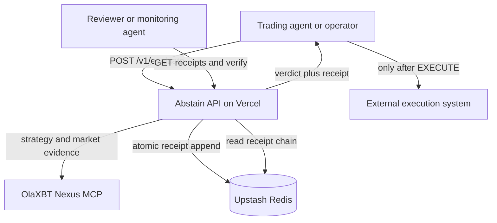

# Abstain architecture

Abstain is a stateless HTTP decision service backed by a durable, append-only receipt chain. It sits between an agent that wants to execute a trade and the execution system that may act on an approved verdict. Abstain never places the order itself.

## System context

## Request flow

1. The caller authenticates with `X-ABSTAIN-KEY` and submits `symbol`, `side`, `notional`, and an optional policy name.
2. The API validates request size and shape before consuming rate-limit capacity.
3. The Nexus client fetches the strategy signal, metrics, equity, trades, historical funding, open interest, and coverage data in parallel.
4. Every Nexus payload is checked for structure, types, semantic ranges, requested symbol/date agreement, and chronological integrity.
5. The deterministic gate runs eleven checks for freshness, qualification, funding regime, open-interest shock, drawdown, correlated exposure, loss streak, missing data, size, and duplicate use.
6. The service derives the signal identifier from Nexus data and builds a canonical receipt containing the policy hash, input digest, checks, verdict, reason, and previous chain hash.
7. Redis executes an atomic Lua compare-and-append. If another writer changed the head, Abstain reloads the chain, recomputes stateful checks, and retries.
8. Only a durably committed receipt is returned. Store failure or unresolved contention returns a named 503 and no verdict.

## Trust boundaries

| Boundary | Threat | Control |
| --- | --- | --- |
| Caller → API | Unauthorized writes, oversized or malformed input, caller-forged signal identity | Constant-time key comparison, actual-byte request limit, schema validation, server-derived identity |
| Nexus → decision engine | Malformed, stale, mismatched, incomplete, or semantically impossible evidence | Payload validation plus fail-closed `DATA_GAP` behavior |
| Decision engine → receipt store | Concurrent writers use stale duplicate state or fork the chain | Snapshot-bound evaluation and atomic compare-and-append |
| Deployment → reviewer | A healthy URL runs a different commit or silently uses memory | Public commit headers/proof endpoint and durable readiness probe |
| Receipt chain → public reader | Historical records are altered or deleted | Canonical SHA-256 links and first-divergence verification |

## Components

| Component | Responsibility |
| --- | --- |
| `src/app.ts` | HTTP routes, authentication, request limits, rate limits, readiness, and error mapping |
| `src/nexus/` | Nexus calls, retry/error classification, point-in-time resolution, caching, and trust-boundary validation |
| `src/gate/` | Pure deterministic checks with no network or ambient clock |
| `src/evaluate.ts` | Evidence orchestration, signal identity, policy selection, contention-aware re-evaluation |
| `src/receipt/` | Canonical hashing and full-chain verification |
| `src/store/` | Memory adapter for replay and Redis adapter for production CAS/rate limiting |
| `scripts/verify-live.sh` | Deployment binding, safe-failure, concurrency, and independent hash canary |

## Deployment topology

Vercel can run many short-lived instances. They share no process memory, so production writes require Upstash Redis. Both Vercel KV (`KV_REST_API_*`) and direct Upstash (`UPSTASH_REDIS_REST_*`) environment names are supported. A production deployment without a complete credential pair reports `durable:false` and refuses evaluation.

`/health` intentionally has no Nexus or Redis dependency. It answers whether the process is alive and which commit it runs. `/v1/ready` answers whether the deployment can currently produce durable evaluations. Keeping those questions separate prevents a third-party outage from hiding source identity while still making degraded write capability loud.

## Data and retention

Receipts contain proposal fields, normalized evidence summaries, checks, timestamps, hashes, and reasons. They do not contain Nexus keys or the write key. Receipts are retained indefinitely because deleting a record would invalidate every later link. Rate limits bound public demo-chain growth.

## Deliberate boundaries

- Abstain authorizes or refuses; it does not execute trades, hold funds, or sign transactions.
- The chain proves what the service recorded and detects later alteration; it is not confidentiality or a blockchain consensus system.
- `EXECUTE` means the configured policy passed for the referenced evidence. It is not investment advice or a guarantee of profitability.
- Replay fixtures make local evaluation deterministic. Production uses live Nexus and durable Redis.

## Verification surfaces

- `GET /health`: liveness and exact source commit.
- `GET /.well-known/xagent-verification.json`: public slug/commit deployment proof.
- `GET /v1/ready`: Nexus, store, and durability state.
- `GET /v1/receipts`: public evidence history.
- `GET /v1/verify`: independent chain recomputation.
- `scripts/verify-live.sh`: automated end-to-end production proof.
