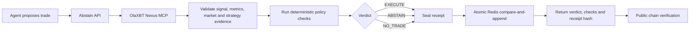

# Abstain

Abstain is a pre-trade execution gate for agentic trading systems. It fetches strategy and market evidence from Nexus, evaluates ten deterministic checks, and returns `EXECUTE`, `ABSTAIN`, or `NO_TRADE`. Every evaluation is written to a publicly verifiable SHA-256 receipt chain before the API responds.

Abstain never places orders and never holds funds. Its job is narrower: decide whether a proposed action is allowed, explain the decision, and leave evidence that can be independently checked.

## The problem it solves

Trading agents can turn a strategy signal into an order in milliseconds, but the evidence behind that order is often fragmented across market-data calls, strategy metrics, logs, and process memory. That creates four practical pain points:

- **A decision is hard to explain.** Operators see an order or refusal without one durable record of the evidence, thresholds, and policy that produced it.
- **Missing data can fail open.** A timeout, malformed payload, or stale signal can be mistaken for a harmless default and accidentally authorize a trade.
- **Retries can duplicate execution.** Two agents or serverless instances can act on the same signal unless replay protection and the final write are atomic.
- **Audit trails can look durable when they are not.** An in-memory log resets on a cold start and diverges across instances while every individual request still appears successful.

Abstain turns those failure modes into an explicit API contract: trustworthy evidence produces a deterministic decision; uncertainty produces `ABSTAIN`; no proposed trade produces `NO_TRADE`; and no verdict is returned until its receipt is durably appended.

## Why Nexus is essential

OlaXBT Nexus is the source of the strategy proposal and the evidence needed to evaluate it: live signals, qualification metrics, equity history, trades, funding, open interest, and historical coverage. Remove Nexus and Abstain has neither a proposal to gate nor a strategy record to verify. Abstain is therefore an application built around Nexus, not a thin proxy: it validates Nexus evidence, applies ten independent execution checks, prevents duplicate authorization, and creates a public proof artifact Nexus does not provide on its own.

## How it works



The API separates liveness from readiness. `/health` identifies the exact deployed source without depending on external services. `/v1/ready` proves that Nexus and the durable receipt store are usable. The complete component and request flow is documented in [ARCHITECTURE.md](ARCHITECTURE.md).

## What makes the proof credible

- All ten checks are deterministic and versioned by `policy_hash`; no LLM sits in the authorization path.
- Nexus responses cross a strict trust boundary before any threshold comparison.
- The server derives signal identity, so callers cannot rename a repeated signal.
- Redis Lua compare-and-append binds the decision to the exact chain snapshot it evaluated.
- Receipts are publicly readable and independently recomputable from genesis.
- Production refuses to evaluate when storage is ephemeral or unavailable.

## Quick start

```bash
npm ci
npm test

ABSTAIN_WRITE_KEY=local-test-key \
COMMIT_SHA="$(git rev-parse HEAD)" \
ABSTAIN_NOW=1789689600000 \
npm run dev
```

In another terminal:

```bash
curl -s -X POST http://localhost:3000/v1/evaluate \
  -H 'content-type: application/json' \
  -H 'x-abstain-key: local-test-key' \
  -d '{"symbol":"BTC/USDT","side":"BUY","notional":15000,"policy":"strict"}' | jq

curl -s http://localhost:3000/v1/verify | jq
```

Replay mode is the default. It uses committed Nexus fixtures and an in-memory receipt store, so local evaluation needs no Nexus or Redis credentials. Local `/v1/ready` intentionally returns `503` with `durable:false`; production refuses writes unless Redis is configured.

## Documentation

- [Build your first verifiable evaluation](docs/tutorial-getting-started.md) — start locally and inspect a receipt from end to end.
- [How to test and deploy Abstain](docs/how-to-test-and-deploy.md) — run offline gates, configure production, and verify a deployment.
- [HTTP API and configuration reference](docs/reference-api.md) — endpoints, request shapes, environment variables, limits, and errors.
- [Why Abstain uses a fail-closed receipt chain](docs/explanation-receipt-chain.md) — design rationale, concurrency model, and trade-offs.
- [Architecture](ARCHITECTURE.md) — components, data flow, trust boundaries, and deployment topology.
- [Demo video script](docs/demo-video-script.md) — a timed recording plan for judges.
- [Submission verification evidence](submission/verification/README.md) — reviewer-focused reproduction steps.
- [Fixture provenance](fixtures/README.md) — which evidence is recorded or synthetic.

## Development commands

| Command | Purpose |
| --- | --- |
| `npm test` | Run the 162-test offline suite. |
| `npm run typecheck` | Type-check without emitting JavaScript. |
| `npm run build` | Compile production JavaScript into `dist/`. |
| `npm run dev` | Build and start the local server on port 3000. |
| `npm run chart` | Regenerate the with-gate/without-gate replay evidence. |
| `npm run frontier` | Regenerate the policy frontier evidence. |
| `npm run record` | Re-record Nexus fixtures; requires live Nexus credentials. |

## Core guarantees

- The decision path is deterministic and contains no LLM call.
- Missing, malformed, mismatched, or unavailable evidence cannot become permission to trade.
- Production cannot write receipts to process-local memory.
- Concurrent writers cannot fork the receipt chain.
- Duplicate non-HOLD signals cannot be authorized twice.
- Anyone can read receipts and recompute the chain without credentials.

## License and rights

See [submission/RIGHTS.md](submission/RIGHTS.md).
